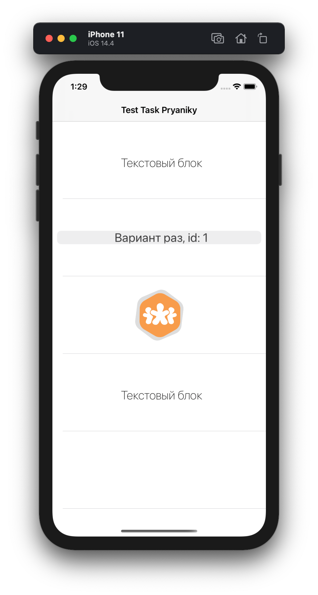

## Test Task Pryaniky
### Задача

- Создать приложение, которое будет получать JSON,
со списком данных нескольких типов (например: картинка, блок текста, селектор одного 
варианта из N) и списком кого, 
какие блоки данных и в каком порядке надо отобразить.
- Отображать список указанных элементов, и, при клике на них 
(или выборе одного из вариантов ответа), выводить информацию, что за объект инициировал событие 
(например: id, имя)

## Features
- MVVM architecture
- Alamofire
- Moya
- Kingfisher

#### Screenshot of the main screen

